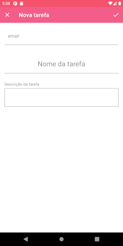

# Desafio Sofie

     

Aplicativo gerenciador de tarefas, com comunicação com API externa

> obs:
>
> - Como requisito, este aplicativo deveria ser disponível a partir da API 16.
> Entretando, para conseguir usa-lo com uma Api abaixo da 22, é preciso seguir os seguintes passos.
>
>
> - buildSrc/src/main/java/Dependencies.kt (sdk_version -> mudar para versão a ser testada)
>